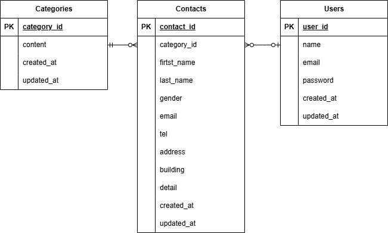

# お問い合わせフォーム

## 環境構築

### Dockerビルド
　1.git clone git@github.com:mami-kbb/contact-form.git
  2.docker-compose up -d --build
  *MySQLはOSによって起動しない場合があるので、どれぞれのPCに合わせて docker-compose.yml ファイルを編集してください。

### Laravel環境構築
 1.docker-compose exec php bash
 2.composer install
 3..env.exampleファイルから.envファイルを作成し、環境変数を変更
 cp .env.example .env

 DB_CONNECTION=mysql
 DB_HOST=mysql
 DB_PORT=3306
 DB_DATABASE=laravel_db
 DB_USERNAME=laravel_user
 DB_PASSWORD=laravel_pass
 4.php artisan key:generate
 5.php artisan migrate
 6.php artisan db:seed

 ## 使用技術(実行環境)
 ・nginx:1.21.1
 ・PHP:8.1-fpm
 ・Laravel:8.75 local=ja
 ・MySQL:8.0.26
 ・phpmyadmin/phpmyadmin
 
## ER図

## 補足
・confirm画面から「送信」ボタンをクリックしたときに正しくthanks画面に行くことができませんでした。（直接http://localhost/thanksにはアクセスできます。）
・admin画面をlogout後はcontact画面に移行します。

## URL
・開発環境：http://localhost/
・phpMyAdmin：http://localhost:8080/
 
